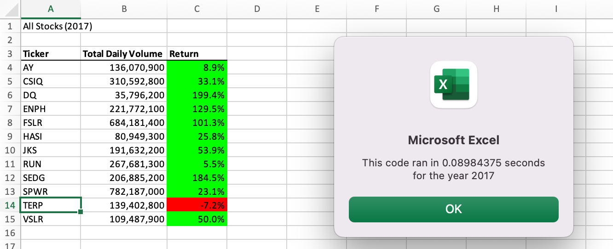

# Stock-Analysis
Stock Analysis Module 2 VBA GWU Data Analytics Bootcamp
## Overview of Project
VBA is a powerful analytical tool  often used in the financial industry, among others, to analyze and adjust big amounts of data, create portfolios, forecast sales and profits and generate financial risks. In this project we are applying VBA functionality to help Steve analyze a dataset that includes stock market prices of the year 2017 and 2018 with the purpose of generating  insights that can influence Steve’s parents decisions and accomplish their goal of investing at a lower cost and getting higher returns. 

To achieve this goal we are going to run a line of code throughout our dataset to find  the total daily volume and yearly return of each stock.  In the past we helped Steve’s parents to draw information from this same dataset. The same process that was used back then will be applied to this new project.This process is called refactoring  which means  that the same code will be applied but only small changes will be made to the code in order to make it more efficient and fast since that dataset contains more information than the data that was previously analyzed. 

Using the same line of code is very helpful and convenient when data needs to be pulled over time, which is beneficial for Steve’s parents in case they want to keep track of the stock market in the future.  

## Results
Investing in the stock market comes with risks but a good strategy to avoid financial loss is monitoring the market  and VBA has helped Steve to do so by tracking stocks performance and  predicting their future direction. 

By calculating the yearly return value, which is the percentage increase or decrease in price from the beginning of the year to the end of the year we used the first closing price and last closing price of each stock. This value helped Steve to determine how well  a company’s business was doing over two consecutive years.
The next two tables show the performance of each stock from 2017 and 2018, as well as the time needed to run our code through all the dataset. 

The analysis helped us determine what stocks perform better over two consecutive years.This report indicates that two tickers, RUN and ENPH, have better  financial stability, profitability, and growth, being RUN the ticker who performed better of the two with a higher return a year after our first report.  A good practice is to invest in the stock market for the long-term since it has proven to be an excellent way to build wealth over time. We recommend Steve to keep tracking the stock market using this VBA macro to help him make better informed decisions and investments. 

### Analysis Of Stock Market 2017 
 

### Analysis Of Stock Market 2018

## Summary

- What are the advantages or disadvantages of refactoring code? The advantages of refactoring code, from a developer perspective, are that they help prevent and anticipate  a code from becoming over complicated, difficult to read and more time consuming when it comes to debugging the code. By refactoring our code we make it cleaner, simpler and efficient , which means that our code or application will be running fast, secure and reliable, resulting in a code that will use less memory and future users will take less steps running it. On the other hand, refactoring can make our code inefficient and could introduce new errors that can be time consuming. 

- How do these pros and cons apply to refactoring the original VBA script?  Refactoring made this project easier and took less time to get our results. We only had to make small changes in order to find the information needed but in fact the external behavior did not change and the user interface remained the same.  
